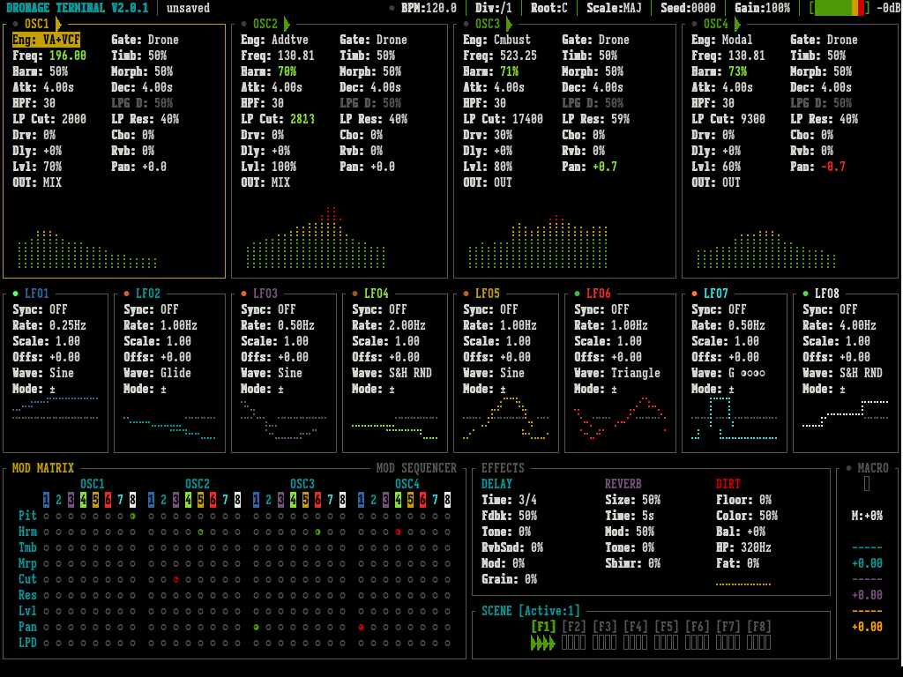

# Dronage Terminal — TrimUI Brick PAK

A drone workstation for the TrimUI Brick, featuring 4 macro oscillators, extensive modulation capabilities, and custom tailored effects.

## Install

Available via **PAK Store** on NextUI. Connect your TrimUI Brick to Wi-Fi, open PAK Store from the Tools menu, and install Dronage Terminal.

## User Data

Presets, recordings, and tuning files are stored in:

```
/mnt/SDCARD/DronageTerminal/
```

This folder is on the root of your SD card for easy access. It survives PAK updates. On first launch, bundled Scala tuning files are automatically copied there.

## Manual Installation

If for whatever reason you do not have the PAK Store:

1. Download the latest release from this repo.
2. Unzip the release download.
3. If the unzipped folder name is `Dronage.Terminal.pak` please rename it to `Dronage Terminal.pak`.
4. Copy the entire `Dronage Terminal.pak` folder to `SD_ROOT/Tools/tg5040`.
5. Reinsert your SD Card into your device.
6. Launch Dronage Terminal from the Tools menu.

## Screenshots



